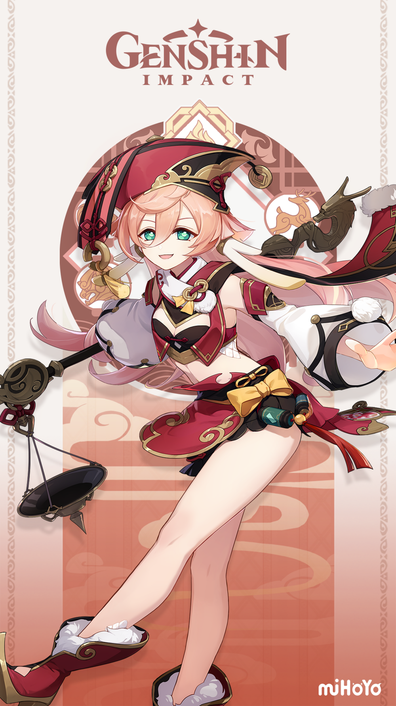
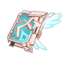
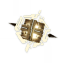
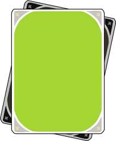
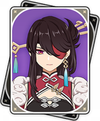

By: satsuki#9043  
[Court of Yanfei Discord](https://discord.gg/courtofyanfei)  

  
*A half-illuminated beast and highly-skilled legal adviser. She combines adherence to the legal codices and reasonable flexibility to find the perfect balance in her work. She devotes herself to protecting the fairness of contracts in Liyue with her identity as a legal adviser and her unique experience and methods.*  
– Official Genshin Website  
**Rarity:** 4-star  
**Element:** Pyro  
**Weapon:** Catalyst  

# Introduction
Yanfei is a Pyro Catalyst character released in 1.5. Her kit focuses heavily on Charge Attacks.
\[Write about Yanfei's role, how she plays, etc\]
## Pros
- Absurdly long range
\[TODO Add more pros\]
## Cons
- Low stamina due to constant Charge Attacks
\[TODO Add more cons\]

# Talents
### Normal Attack: Seal of Approval
  
Yanfei's basic attack talent. As a Main DPS unit, Yanfei's **main source of DPS** involves her **Charged Attack** and the **Scarlet Seals** mechanics. The Scarlet Seals, generated by Normal Attacks, **increase the power of Yanfei's Charged Attack** and **reduce her stamina consumption**. The Seals are consumed in the process. The point that **Charged Attack is the main source of Yanfei's DPS** is the main reason for many of her build choices, and it will be **repeatedly highlighted** throughout this document.

### Signed Edict
  
Yanfei's Elemental Skill. Deals a moderate amount of damage once and **generates the maximum number of Scarlet Seals**. The best part of this talent is, of course, the Scarlet Seals, which doesn't scale per talent levels at all. There is no need to invest in this talent.

### Done Deal
  
Yanfei's Elemental Burst. Deals a moderate amount of damage, generates the maximum number of Scarlet Seals at activation, **generates one more Seals per second**, and **increses Yanfei's Charged Attack DMG**, for 15 seconds. As said above, Yanfei's entire kit revolves around Charged Attacks, and this talent signifies how much it does.

### Talent Priority
Normal Attack > Elemental Burst >>>>>>>>>>>>>>> Elemental Skill

### Passive: Encyclopedic Expertise
  
*Displays the location of nearby resources unique to Liyue on the mini-map.*  

Helps a bit on material gathering.

### Ascension 1: Proviso
  
*When Yanfei consumes Scarlet Seals by using a Charged Attack, each Scarlet Seal will **increase Yanfei's Pyro DMG Bonus by 5%**. This effect lasts for 6s. When a Charged Attack is used again during the effect's duration, it will dispel the previous effect.*  

Free Damage. Each time Yanfei performs a Charged Attack, a number will appear to signify how many Seals are consumed.

### Ascension 4: Blazing Eye
  
*When Yanfei's Charged Attack deals a CRIT Hit to opponents, she will deal an additional instance of **AoE Pyro DMG equal to 80% of her ATK**. This DMG counts as Charged Attack DMG.*  

More Damage. However, unlike the Ascension 1 Passive, this one isn't free. The additional hit comes with **additional Pyro application**, which can disturb the aura application of the team's supports. This talent is the main cause of the need to modify Yanfei's combo to fit her supports, which will be detailed below.

# Constellations
### C1: The Laws Knows No Kindness
  
*When Yanfei uses her Charged Attack, each existing Scarlet Seal additionally reduces the stamina cost of this Charged Attack by 10% and increases resistance against interruption during its release.*  

This constellation helps alleviate stamina issues. It makes Yanfei able to spam more Charged Attacks and dodge enemies' attacks. This is Yanfei's best constellation. Try to get this if you can.

### C2: Right of Final Interpretation
  
*Increases Yanfei's Charged Attack CRIT Rate by 20% against enemies below 50% HP.*  

Effectively a 10% CRIT Rate boost. It's free damage, and it's a fine constellation.

### C3: Samadhi Fire-Forged
  
*Increases the Level of Signed Edict by 3. Maximum upgrade level is 15.*  

This constellation improves Yanfei's **Elemental Skill**. As described above, the Elemental Skill's level doesn't contribute much to Yanfei's DPS, so this constellation isn't a good one to aim for.

### C4: Supreme Amnesty
  
*When Done Deal is used: Creates a shield that absorbs up to 45% of Yanfei's Max HP for 15s. This shield absorbs Pyro DMG 250% more effectively.*  

Provides a shield. It contributes nothing to DPS directly, but makes fighting in close range more comfortable. The duration is the same as the ult. It's good to have but not necessary.

### C5: Abiding Affidavit
  
*Increases the level of Done Deal by 3. Maximum upgrade level is 15.*  

This constellation improves Yanfei's **Elemental Burst**. More level of burst means more Charged Attack DMG Bonus, which contributes to a major portion of DPS. This is considered Yanfei's second best constellation.

### C6: Extra Clause
  
*Increases the maximum number of Scarlet Seals by 1.*  

This increases the maximum number Scarlet Seals from 3 to 4. It may or may not help you depending on Yanfei's optimal combo for your team. One interesting thing to note is Charge Attacking with 4 Scarlet Seals **consumes zero stamina**. This constellation opens more gameplay options and is generally a good one.

# Weapons
|5 stars       |   |
|:------------:|---|
| Skyward Atlas|The Skyward Atlas is best in slot in terms of DPS. With **highest base ATK in the game**, **Elemental DMG Bonus**, and **additional hits**, this weapon is pure power. You couldn't ask much more than this.|
| Lost Prayer to the Sacred Winds|The Lost Prayer has slightly less damage than the Skyward Atlas. To pull ahead, you need to be on field for around 12 seconds. However, you'll want to swap Yanfei out not long after that since that's around when the supports' buffs run out. That said, the **crit stat** still makes it easier to build artifacts, and the **movement speed** is also a good stat on Yanfei considering how squishy she is. Overall, this weapon is still very good and is **more or less equal** to Skyward Atlas if you value the slightly better comfortability.|
| Memory of Dust|The Geo series weapon. The Memory of Dust also gives good damage if you can maintain 100% shield uptime. It has the downside of limiting your team choice, but it's still a great weapon.|

|4 stars       |   |
|:------------:|---|
| The Widsith|The Widsith is a great weapon for Yanfei. With a **crit stat**, it's easier to build good crit ratio on artifacts. Furthermore, Yanfei can use **all** of its three effects extremely well, especially if you play with Vaporize. The only downside is its long cooldown, which affect the overall damage output if you play Yanfei as a sustained DPS. At **high refine**, it's a very good choice among four stars. However, at low refine, some of the other options might be better.|
| Dodoco Tales|Dodoco Tales, the free weapon from the 1.6 Midsummer Islands Adventure event, is another great choice. It grants **bonus to Charged Attack**, which is a big portion of Yanfei's output. Compared to The Widsith, this weapon **doesn't lose effectiveness in a long fight** and **is very easy to max refine**, so it can be a better choice than low refine Widsith. A solid weapon overall.|
| Solar Pearl|The battle pass weapon. Another solid choice with its **crit stat**. Although, its effect, **granting Normal Attack, Elemental Skill, and Elemental Burst DMG Bonus**, isn't big compared to the other two above due to how big of a deal Charged Attacks are for Yanfei. Overall it's slightly worse than The Widsith and Dodoco Tales, but still a viable choice. You can't go wrong with a battle pass weapon.|
| Mappa Mare|The craftable weapon. A solid stat stick. With its **Elemental Mastery** stat, you're pretty much locked in to a **Melt or Vaporize** team. Still a good F2P choice if you missed Dodoco Tales.|
| Blackcliff Agate|The Starglitter shop weapon. It has the exact same base stats as The Widsith, but a significantly worse effect. It's a fine F2P choice if you don't have any other options.|

# Artifacts
### Main stats
The main stats are built like typical DPS.  
- **Sands:** *Elemental Mastery* or *ATK*  
- **Cup:** *Pyro DMG Bonus*  
- **Hat:** *CRIT Rate* or *CRIT Damage*  

The choices for Cup and Hat are usually undisputed. In general, you want to evenly distribute each stat that contributes to damage output. DMG Bonus and CRIT stats are hard to come by, so they are the preferred choices for the slots that can get them. Although, since Yanfei has so many sources of DMG Bonus, there might be a case for an ATK Cup if its substats are much better than your Pyro Cup, but it really depends on the actual piece you have.

For the Sands choice, it depends on what your Yanfei does for your team.  
- **Melt, Vaporize ("Amp" build):** Prefer **Elemental Mastery** Sands. It has slightly better damage output, especially if you use an ATK% weapon and have Bennett buff your ATK further. However, **ATK** Sands still has a chance to pull ahead if it has much better substats.  
- **Overload, Reverse Melt, Mono Pyro, etc ("Enabler" build):** Use **ATK** Sands. It improves Yanfei's Charged Attack damage, the largest portion of her DPS. Even with 1.6 buff, it's still **not recommended to build EM for the Overload build** as it isn't guaranteed that Yanfei will always be the trigger.  
- Regarding **Energy Recharge** Sands, building it on Yanfei is **not worth it**. The DMG Bonus from the Elemental Burst is **not big enough** that you need to use it every rotation to do good damage, so you're better off just **improving Yanfei's damage through the actual damage stats**.  

### Substats
Crit Rate/Crit Damage > EM > ATK% > ER  

Typical DPS substat priority. Energy Recharge is good if you can go from ulting **every other** rotation to ulting **every** rotation, but otherwise prefer the damage stats. **Ignore Elemental Mastery if you don't Melt or Vaporize.**

### Set Bonus
|Artifact Set  |   |
|:------------:|---|
| 4x Crimson Witch of Flames|This set amplifies Yanfei's damage with **15% Pyro DMG Bonus** and **reaction damage bonus**. Since everything Yanfei does is Pyro, and you'll want to do reactions with her anyway, this set is a perfect match. You'll realistically only have 1-2 stack for the 4x effect that increases Pyro DMG Bonus, but it's good enough.|
| 4x Wanderer's Troupe|This set also amplifies Yanfei's damage with **80 Elemental Mastery** and **35% Charged Attack DMG**. Elemental Mastery increases reaction damage, and Charged Attack DMG Bonus increases Charged Attack damage, which is the majority of Yanfei's DPS. The logic favouring this set is the same as 4x Crimson Witch. For that reason, this set is considered **equally as good** as 4x Crimson Witch.|
| 4x Retracing Bolide|This set has **35% Shield Strength** and **40% Normal and Charged Attack DMG while shielded**. It's recommended to have C4 or shield support while playing this set. The raw damage this set gives isn't as much as Crimson Witch or Wanderer's Troupe, but it comes with more Shield Strength. Overall, this set is playable if you can fulfill its shield condition.|
| 4x Lavawalker|This set gives **35% DMG Bonus against enemies affected by Pyro**. It's a niche set that requires specific team to shine, but it's playable if you're sure that your enemies will be affected by Pyro most of the time.|

Please be aware that generally a set **bonus** is just that, a bonus. It's usually better to have an off-set piece with good substats than to complete a set with bad substat. Punch your artifacts into a calculator if you want to optimise your DPS.

# Team Compositions
#### Vaporize
     
Pairing a Pyro DPS and a Hydro support to **amplify Pyro damage via Vaporize** is the gold standard composition since launch. Obviously, it involves Xingqiu, the premier Hydro support guy. You can replace Xingqiu with another Hydro support like Mona or Barbara with varying results. This playstyle often **requires specific combos for Yanfei** to properly **Vaporize her big hits**, which will be detailed below. The flex slots usually consist of buffers and healers: Zhongli for his shield and RES shred, Diona for healing and C6 EM buff, Sucrose for EM buff and RES shred, or Bennett for ATK buff and healing. The main benefit of this team is how it will give good results just by hyperinvesting in Yanfei: Get her to level 80, ascension 6, max her weapons, her talents, and her artifacts, and you're good to go.

#### Taser
     
This composition is similar to the Vaporize team. In addition to a Hydro suppoert, an Electro support is also used to benefit from additional reactions. Enemies affected by **Electro-Charged** have both Electro and Hydro auras remained on them, so a Pyro hit will trigger **both Vaporize and Overload** at the same time. Like the Vaporize team, you can swap Xingqiu and Fischl out for another support of the same element, and anything said about the Vaporize team applies here as well.

#### Overload
     
This team utilises the **Overload** reaction. It is often undesirable to use Overload against small targets since they'll be blasted away. However, unlike other Pyro DPS, Yanfei can utilise her **very long range** to keep attacking those enemies, and blasting them away makes it safer to continue attacking. Although, unlike the Vaporize team, Yanfei's personal damage doesn't get amplified to stellar level, and that means this team needs **more damage from the supports**, and you'll need to actually build them up before the overall team damage becomes competitive.

#### Reverse Melt
     
This team uses Yanfei as an **enabler** for the Melt reaction with a Cryo sub-DPS. In this comp, it's important to build the Cryo unit first since it's their damage that will get amplified. Also, since you'll want the aura on enemies to be Pyro most of the time, and Yanfei is rarely the reaction trigger, the Lavawalker set becomes another contender for preferred artifact sets.

#### Mono Pyro
     
This team utilises Pyro units that **benefit from other Pyro units**, like Xiangling and Bennett. It'll constantly apply Pyro aura and can utilise Lavawalker for DMG Bonus.

# How To Play

\[TODO refine build choice\]
## Builds
Yanfei's role is a selfish main DPS. She will be on field most of the time, only swap to unleash the supports' skills and swap back.  
As with other Pyro DPS, there are generally two ways to build Yanfei based on the Elemental Reactions you want to use.
### Amp Yanfei
This build uses Vaporize or Melt to amplify Yanfei's damage. This means Yanfei will be the *trigger* for the reaction. Usually it'll be Vaporize, as Melt doesn't last long before Yanfei's Pyro application takes over. Due to some quirks in Yanfei's own kit, Amp Yanfei requires specific combo depending on your support. The combos will be discussed in detail further in this guide.
### Enabler Yanfei
This build uses Yanfei to apply Pyro *aura* and enable Elemental Reactions of your sub-DPS. Reverse Melt and Mono Pyro teams are in this category. Overload might be in this category as well if Yanfei is the aura, but that'll depend on your team.

## Combos
### Non-Amp Build
Generally, if you're not playing Amp reactions (Vaporize/Melt), spamming N2C yields maximum motion value per second, which translates to maximum DPS. Use Skill-Charge and Burst-Charge off cooldown in between.

### Amp Build
If you *do* care about those reactions though, You'll need to adjust. Vaporizing or Melting Yanfei's hits requires Yanfei to be the trigger, but N2C applies Pyro too fast for those. Reasons being how fast her Normal Attack animation is, and her Ascension 4 passive applying another separate instance of Pyro.  
**TODO INSERT COMBO GUIDE**
#### Xingqiu
#### C6 Xingqiu
#### Mona

# Summary
